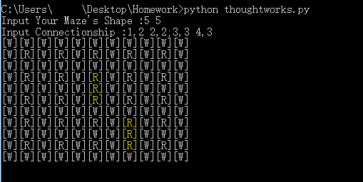
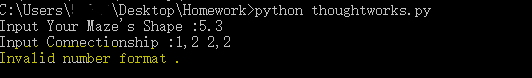
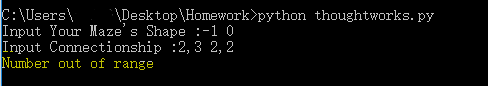
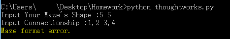
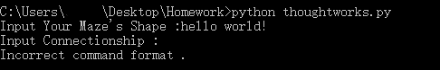

# Maze in Python2.7

Homework of ThoughtWorks achieved by Python2.7，There are some example for how to test my code. 

## Table of Contents
* [Principal of my Maze](#principal of my Maze)
* [User's guide](#users-guide)
* [Test](#test)

## Principal of my Maze
This code is achieved by Python class.

## User's guide
When the class "Maze" is instantiated，it will notice you on command line: `Input Your Maze's Shape :` and `Input Connectionship :`. After that the code will detect if errors would be raised. If nothing is wrong, you can get your own defined maze.
You may also change the version number inside the hyper_parameters.py file

## Test
You can do this by command line: `python thoughtworks.py'`. Then type size and connection relationship information of maze.
Finally get the maze formed by `[W]` and `[R]`.

###Invalid format
If you input wrong format of information, it would return `Invalid number format.`.

###Out of range
If the indice of connecting roads are bigger than maze's size or maze'size is less or equal than 0, it would return `Number out of range.` .

###Maze format error
If the indice of connecting roads are wrong, it would return `Maze format error.`. 

###Incorrect command format 
If you input wrong commands, it would return `Incorrect command format.`. 

